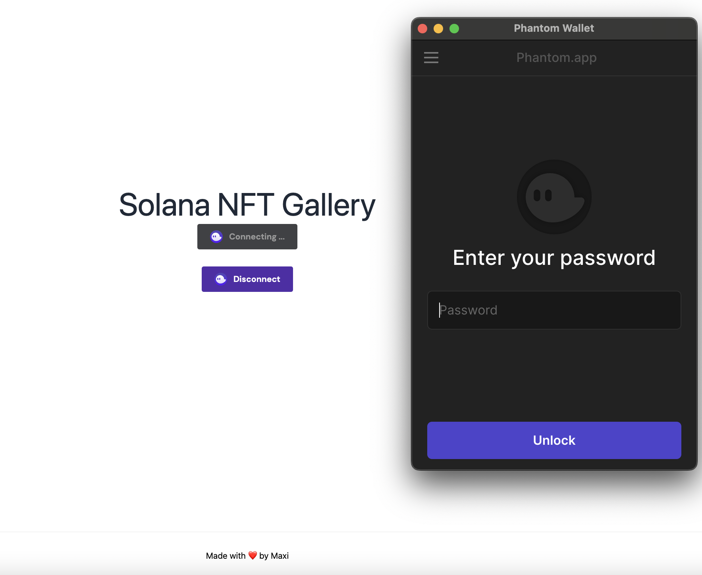
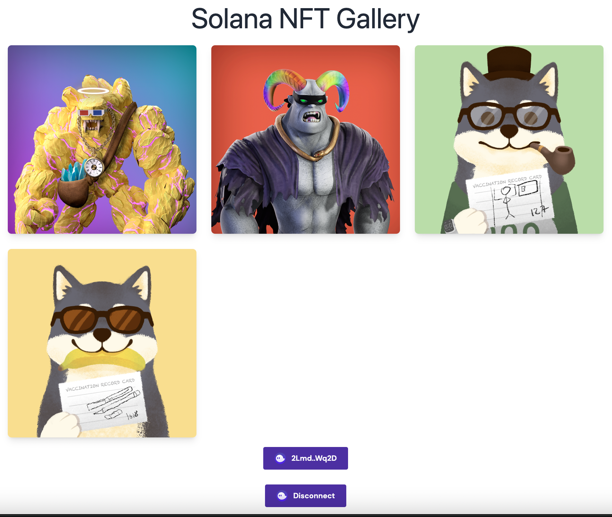

# Solana NFT Gallery (NextJS / TS)
NFT Gallery App built in NextJS that consumes @solana/wallet-adapter
For this you will need a valid wallet with NFTs.

## Setup in local
* `npm install` or `yarn` to install dependencies
* `npm run dev` or `yarn dev` to run development
* `npm run build && npm start` or `yarn run build && yarn run start` for production

Note: The project also has eslint, prettier and husky configured.

Eslint: `yarn lint`